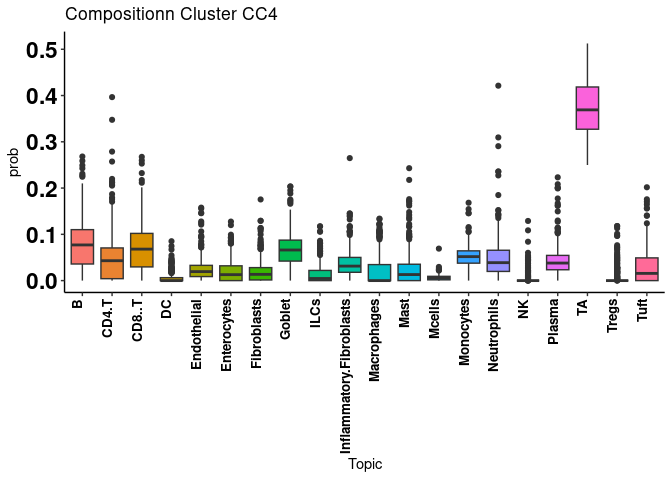
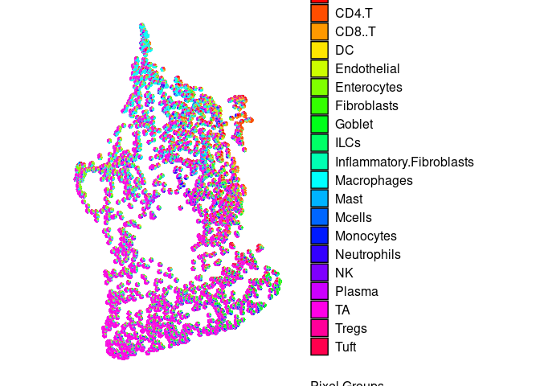
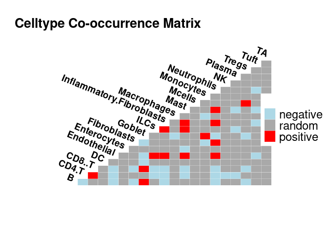
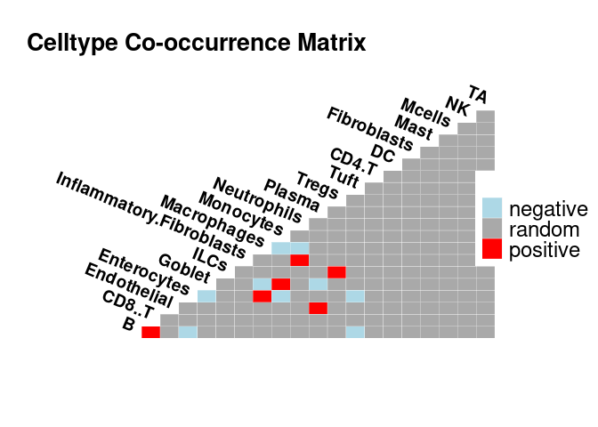

<!-- README.md is generated from README.Rmd. Please edit that file -->

# ISCHIA

<!-- badges: start -->
<!-- badges: end -->

ISCHIA is a framework for analysis of cell-types and Ligand-Receptor
cooccurrences in spatial transcriptomics/proteomics data

## Installation

You can install the development version of ISCHIA from
[GitHub](https://github.com/) with:

``` r
# install.packages("devtools")
devtools::install_github("ati-lz/ISCHIA")
```

## Example

Here we present an example analysis of Visium IBD samples as presented
in the manuscript

``` r

# Loading required packages
library(ISCHIA)
library(robustbase)
library(data.table)
library(ggplot2)
library(Seurat)
library(dplyr)
```

``` r

## basic example code
load("./data/IBD.visium.rda")
IBD.visium.P4 <- subset(IBD.visium, subset = orig.ident == "P4.noninf")
IBD.visium.P4@images <- IBD.visium.P4@images[1]
IBD.visium.P4$orig.ident <- factor(IBD.visium.P4$orig.ident, levels = unique(IBD.visium.P4$orig.ident))

# Extracting the deconvoluted cell type probability matrix from metadata
deconv.mat <- as.matrix(IBD.visium.P4@meta.data[,9:28])
colnames(deconv.mat) <- sapply(colnames(deconv.mat), function(x) unlist(strsplit(x, split = "_"))[2])

head(deconv.mat)
#>                                         B        CD4.T       CD8..T          DC
#> P4.noninf_AAACAAGTATCTCCCA-1 1.108271e-01 0.0362490681 6.290875e-02 0.000000000
#> P4.noninf_AAACACCAATAACTGC-1 9.073125e-18 0.0002448368 5.678951e-02 0.002088078
#> P4.noninf_AAACAGAGCGACTCCT-1 1.829942e-01 0.1402780551 2.331465e-01 0.010488728
#> P4.noninf_AAACAGCTTTCAGAAG-1 1.621216e-01 0.0352554936 5.044957e-02 0.000000000
#> P4.noninf_AAACAGGGTCTATATT-1 3.582042e-02 0.0209850943 3.002905e-02 0.000000000
#> P4.noninf_AAACCACTACACAGAT-1 2.507848e-02 0.0000000000 2.366519e-17 0.000000000
#>                              Endothelial Enterocytes Fibroblasts     Goblet
#> P4.noninf_AAACAAGTATCTCCCA-1 0.004099481 0.046614486 0.006422975 0.08758596
#> P4.noninf_AAACACCAATAACTGC-1 0.017366582 0.045454252 0.011204734 0.01505300
#> P4.noninf_AAACAGAGCGACTCCT-1 0.066871597 0.000000000 0.019993125 0.00414359
#> P4.noninf_AAACAGCTTTCAGAAG-1 0.023326680 0.000000000 0.021278051 0.09004006
#> P4.noninf_AAACAGGGTCTATATT-1 0.153044498 0.005291094 0.022228189 0.04005296
#> P4.noninf_AAACCACTACACAGAT-1 0.030983112 0.000000000 0.079750813 0.15073662
#>                                     ILCs Inflammatory.Fibroblasts Macrophages
#> P4.noninf_AAACAAGTATCTCCCA-1 0.000000000              0.009060087  0.00000000
#> P4.noninf_AAACACCAATAACTGC-1 0.013246080              0.021456711  0.32066116
#> P4.noninf_AAACAGAGCGACTCCT-1 0.030934220              0.035149799  0.07700440
#> P4.noninf_AAACAGCTTTCAGAAG-1 0.005617524              0.098616402  0.05451802
#> P4.noninf_AAACAGGGTCTATATT-1 0.025515429              0.114602744  0.09867344
#> P4.noninf_AAACCACTACACAGAT-1 0.008695323              0.019398533  0.03754245
#>                                      Mast       Mcells   Monocytes Neutrophils
#> P4.noninf_AAACAAGTATCTCCCA-1 2.528502e-02 6.898513e-03 0.051761842  0.04649214
#> P4.noninf_AAACACCAATAACTGC-1 1.543687e-17 1.234458e-03 0.009640913  0.05838494
#> P4.noninf_AAACAGAGCGACTCCT-1 2.227816e-02 1.461596e-03 0.017412413  0.02549091
#> P4.noninf_AAACAGCTTTCAGAAG-1 5.593614e-18 6.384781e-05 0.033565754  0.03329163
#> P4.noninf_AAACAGGGTCTATATT-1 4.437177e-02 7.575785e-03 0.048926182  0.11569575
#> P4.noninf_AAACCACTACACAGAT-1 4.090900e-03 9.435438e-20 0.023606947  0.09512971
#>                              NK     Plasma         TA      Tregs        Tuft
#> P4.noninf_AAACAAGTATCTCCCA-1  0 0.03629586 0.46949870 0.00000000 0.000000000
#> P4.noninf_AAACACCAATAACTGC-1  0 0.06631910 0.26288117 0.04539367 0.052580802
#> P4.noninf_AAACAGAGCGACTCCT-1  0 0.00000000 0.01157489 0.12077778 0.000000000
#> P4.noninf_AAACAGCTTTCAGAAG-1  0 0.02627739 0.36557794 0.00000000 0.000000000
#> P4.noninf_AAACAGGGTCTATATT-1  0 0.03422890 0.19499771 0.00000000 0.007960981
#> P4.noninf_AAACCACTACACAGAT-1  0 0.02713631 0.37750862 0.12034218 0.000000000
```

## Celltype Composition clustering

``` r

# Deciding about the k
Composition.cluster.k(deconv.mat, 20)
```


``` r

# Composition clustering of the deconvoluted spatial spots
IBD.visium.P4 <- Composition.cluster(IBD.visium.P4, deconv.mat, 8)
#not good...Idents(IBD.visium.P4) <- "CompositionCluster_CC"

table(IBD.visium.P4$CompositionCluster_CC)
#> 
#> CC1 CC2 CC3 CC4 CC5 CC6 CC7 CC8 
#> 412 161 250 309 396 296 246 115

SpatialDimPlot(IBD.visium.P4, group.by = c("CompositionCluster_CC")) + scale_fill_manual(values = c("cyan", "orange", "purple","green","yellow","blue", "red","black"))
#> Scale for fill is already present.
#> Adding another scale for fill, which will replace the existing scale.
```


We can check the leading cell types of each CC

``` r
Composition_cluster_enrichedCelltypes(IBD.visium.P4,"CC4", deconv.mat)
```



``` r
Composition_cluster_enrichedCelltypes(IBD.visium.P4,"CC7", deconv.mat)
```


We can explore the UMAP representation of the spot based on their
deconvoluted cell type composition

``` r
IBD.visium.P4.umap <- Composition_cluster_umap(IBD.visium.P4, deconv.mat)
#> Plotting scatterpies for 2185 pixels with 20 cell-types...this could take a while if the dataset is large.
IBD.visium.P4.umap$umap.cluster.gg
```


``` r
IBD.visium.P4.umap$umap.deconv.gg
```



## Celltype Cooccurrence analysis

We choose CC4 and CC7 to check the celltype cooccurrences

``` r
CC4.celltype.cooccur <- spatial.celltype.cooccurence(spatial.object=IBD.visium.P4,
                                                      deconv.prob.mat=deconv.mat,
                                                      COI="CC4", prob.th= 0.05, Condition=unique(IBD.visium.P4$orig.ident))
#>   |                                                                              |                                                                      |   0%  |                                                                              |=                                                                     |   1%  |                                                                              |=                                                                     |   2%  |                                                                              |==                                                                    |   2%  |                                                                              |==                                                                    |   3%  |                                                                              |===                                                                   |   4%  |                                                                              |===                                                                   |   5%  |                                                                              |====                                                                  |   5%  |                                                                              |====                                                                  |   6%  |                                                                              |=====                                                                 |   7%  |                                                                              |=====                                                                 |   8%  |                                                                              |======                                                                |   8%  |                                                                              |======                                                                |   9%  |                                                                              |=======                                                               |  10%  |                                                                              |========                                                              |  11%  |                                                                              |========                                                              |  12%  |                                                                              |=========                                                             |  12%  |                                                                              |=========                                                             |  13%  |                                                                              |==========                                                            |  14%  |                                                                              |==========                                                            |  15%  |                                                                              |===========                                                           |  15%  |                                                                              |===========                                                           |  16%  |                                                                              |============                                                          |  17%  |                                                                              |============                                                          |  18%  |                                                                              |=============                                                         |  18%  |                                                                              |=============                                                         |  19%  |                                                                              |==============                                                        |  20%  |                                                                              |===============                                                       |  21%  |                                                                              |===============                                                       |  22%  |                                                                              |================                                                      |  22%  |                                                                              |================                                                      |  23%  |                                                                              |=================                                                     |  24%  |                                                                              |=================                                                     |  25%  |                                                                              |==================                                                    |  25%  |                                                                              |==================                                                    |  26%  |                                                                              |===================                                                   |  27%  |                                                                              |===================                                                   |  28%  |                                                                              |====================                                                  |  28%  |                                                                              |====================                                                  |  29%  |                                                                              |=====================                                                 |  30%  |                                                                              |======================                                                |  31%  |                                                                              |======================                                                |  32%  |                                                                              |=======================                                               |  32%  |                                                                              |=======================                                               |  33%  |                                                                              |========================                                              |  34%  |                                                                              |========================                                              |  35%  |                                                                              |=========================                                             |  35%  |                                                                              |=========================                                             |  36%  |                                                                              |==========================                                            |  37%  |                                                                              |==========================                                            |  38%  |                                                                              |===========================                                           |  38%  |                                                                              |===========================                                           |  39%  |                                                                              |============================                                          |  40%  |                                                                              |=============================                                         |  41%  |                                                                              |=============================                                         |  42%  |                                                                              |==============================                                        |  42%  |                                                                              |==============================                                        |  43%  |                                                                              |===============================                                       |  44%  |                                                                              |===============================                                       |  45%  |                                                                              |================================                                      |  45%  |                                                                              |================================                                      |  46%  |                                                                              |=================================                                     |  47%  |                                                                              |=================================                                     |  48%  |                                                                              |==================================                                    |  48%  |                                                                              |==================================                                    |  49%  |                                                                              |===================================                                   |  50%  |                                                                              |====================================                                  |  51%  |                                                                              |====================================                                  |  52%  |                                                                              |=====================================                                 |  52%  |                                                                              |=====================================                                 |  53%  |                                                                              |======================================                                |  54%  |                                                                              |======================================                                |  55%  |                                                                              |=======================================                               |  55%  |                                                                              |=======================================                               |  56%  |                                                                              |========================================                              |  57%  |                                                                              |========================================                              |  58%  |                                                                              |=========================================                             |  58%  |                                                                              |=========================================                             |  59%  |                                                                              |==========================================                            |  60%  |                                                                              |===========================================                           |  61%  |                                                                              |===========================================                           |  62%  |                                                                              |============================================                          |  62%  |                                                                              |============================================                          |  63%  |                                                                              |=============================================                         |  64%  |                                                                              |=============================================                         |  65%  |                                                                              |==============================================                        |  65%  |                                                                              |==============================================                        |  66%  |                                                                              |===============================================                       |  67%  |                                                                              |===============================================                       |  68%  |                                                                              |================================================                      |  68%  |                                                                              |================================================                      |  69%  |                                                                              |=================================================                     |  70%  |                                                                              |==================================================                    |  71%  |                                                                              |==================================================                    |  72%  |                                                                              |===================================================                   |  72%  |                                                                              |===================================================                   |  73%  |                                                                              |====================================================                  |  74%  |                                                                              |====================================================                  |  75%  |                                                                              |=====================================================                 |  75%  |                                                                              |=====================================================                 |  76%  |                                                                              |======================================================                |  77%  |                                                                              |======================================================                |  78%  |                                                                              |=======================================================               |  78%  |                                                                              |=======================================================               |  79%  |                                                                              |========================================================              |  80%  |                                                                              |=========================================================             |  81%  |                                                                              |=========================================================             |  82%  |                                                                              |==========================================================            |  82%  |                                                                              |==========================================================            |  83%  |                                                                              |===========================================================           |  84%  |                                                                              |===========================================================           |  85%  |                                                                              |============================================================          |  85%  |                                                                              |============================================================          |  86%  |                                                                              |=============================================================         |  87%  |                                                                              |=============================================================         |  88%  |                                                                              |==============================================================        |  88%  |                                                                              |==============================================================        |  89%  |                                                                              |===============================================================       |  90%  |                                                                              |================================================================      |  91%  |                                                                              |================================================================      |  92%  |                                                                              |=================================================================     |  92%  |                                                                              |=================================================================     |  93%  |                                                                              |==================================================================    |  94%  |                                                                              |==================================================================    |  95%  |                                                                              |===================================================================   |  95%  |                                                                              |===================================================================   |  96%  |                                                                              |====================================================================  |  97%  |                                                                              |====================================================================  |  98%  |                                                                              |===================================================================== |  98%  |                                                                              |===================================================================== |  99%  |                                                                              |======================================================================| 100%
#> Call:
#> ISCHIA.cooccur(mat = coocur.COI.exp, type = "spp_site", thresh = FALSE, 
#>     spp_names = TRUE, prob = "comb")
#> 
#> 190 pairs were analyzed
#> 
#> Cooccurrence Summary:
plot.celltype.cooccurence(CC4.celltype.cooccur)
```



``` r


CC7.celltype.cooccur <- spatial.celltype.cooccurence(spatial.object=IBD.visium.P4,
                                                      deconv.prob.mat=deconv.mat,
                                                      COI="CC7", prob.th= 0.05, Condition=unique(IBD.visium.P4$orig.ident))
#>   |                                                                              |                                                                      |   0%  |                                                                              |=                                                                     |   1%  |                                                                              |=                                                                     |   2%  |                                                                              |==                                                                    |   2%  |                                                                              |==                                                                    |   3%  |                                                                              |===                                                                   |   4%  |                                                                              |===                                                                   |   5%  |                                                                              |====                                                                  |   5%  |                                                                              |====                                                                  |   6%  |                                                                              |=====                                                                 |   7%  |                                                                              |=====                                                                 |   8%  |                                                                              |======                                                                |   8%  |                                                                              |======                                                                |   9%  |                                                                              |=======                                                               |  10%  |                                                                              |========                                                              |  11%  |                                                                              |========                                                              |  12%  |                                                                              |=========                                                             |  12%  |                                                                              |=========                                                             |  13%  |                                                                              |==========                                                            |  14%  |                                                                              |==========                                                            |  15%  |                                                                              |===========                                                           |  15%  |                                                                              |===========                                                           |  16%  |                                                                              |============                                                          |  17%  |                                                                              |============                                                          |  18%  |                                                                              |=============                                                         |  18%  |                                                                              |=============                                                         |  19%  |                                                                              |==============                                                        |  20%  |                                                                              |===============                                                       |  21%  |                                                                              |===============                                                       |  22%  |                                                                              |================                                                      |  22%  |                                                                              |================                                                      |  23%  |                                                                              |=================                                                     |  24%  |                                                                              |=================                                                     |  25%  |                                                                              |==================                                                    |  25%  |                                                                              |==================                                                    |  26%  |                                                                              |===================                                                   |  27%  |                                                                              |===================                                                   |  28%  |                                                                              |====================                                                  |  28%  |                                                                              |====================                                                  |  29%  |                                                                              |=====================                                                 |  30%  |                                                                              |======================                                                |  31%  |                                                                              |======================                                                |  32%  |                                                                              |=======================                                               |  32%  |                                                                              |=======================                                               |  33%  |                                                                              |========================                                              |  34%  |                                                                              |========================                                              |  35%  |                                                                              |=========================                                             |  35%  |                                                                              |=========================                                             |  36%  |                                                                              |==========================                                            |  37%  |                                                                              |==========================                                            |  38%  |                                                                              |===========================                                           |  38%  |                                                                              |===========================                                           |  39%  |                                                                              |============================                                          |  40%  |                                                                              |=============================                                         |  41%  |                                                                              |=============================                                         |  42%  |                                                                              |==============================                                        |  42%  |                                                                              |==============================                                        |  43%  |                                                                              |===============================                                       |  44%  |                                                                              |===============================                                       |  45%  |                                                                              |================================                                      |  45%  |                                                                              |================================                                      |  46%  |                                                                              |=================================                                     |  47%  |                                                                              |=================================                                     |  48%  |                                                                              |==================================                                    |  48%  |                                                                              |==================================                                    |  49%  |                                                                              |===================================                                   |  50%  |                                                                              |====================================                                  |  51%  |                                                                              |====================================                                  |  52%  |                                                                              |=====================================                                 |  52%  |                                                                              |=====================================                                 |  53%  |                                                                              |======================================                                |  54%  |                                                                              |======================================                                |  55%  |                                                                              |=======================================                               |  55%  |                                                                              |=======================================                               |  56%  |                                                                              |========================================                              |  57%  |                                                                              |========================================                              |  58%  |                                                                              |=========================================                             |  58%  |                                                                              |=========================================                             |  59%  |                                                                              |==========================================                            |  60%  |                                                                              |===========================================                           |  61%  |                                                                              |===========================================                           |  62%  |                                                                              |============================================                          |  62%  |                                                                              |============================================                          |  63%  |                                                                              |=============================================                         |  64%  |                                                                              |=============================================                         |  65%  |                                                                              |==============================================                        |  65%  |                                                                              |==============================================                        |  66%  |                                                                              |===============================================                       |  67%  |                                                                              |===============================================                       |  68%  |                                                                              |================================================                      |  68%  |                                                                              |================================================                      |  69%  |                                                                              |=================================================                     |  70%  |                                                                              |==================================================                    |  71%  |                                                                              |==================================================                    |  72%  |                                                                              |===================================================                   |  72%  |                                                                              |===================================================                   |  73%  |                                                                              |====================================================                  |  74%  |                                                                              |====================================================                  |  75%  |                                                                              |=====================================================                 |  75%  |                                                                              |=====================================================                 |  76%  |                                                                              |======================================================                |  77%  |                                                                              |======================================================                |  78%  |                                                                              |=======================================================               |  78%  |                                                                              |=======================================================               |  79%  |                                                                              |========================================================              |  80%  |                                                                              |=========================================================             |  81%  |                                                                              |=========================================================             |  82%  |                                                                              |==========================================================            |  82%  |                                                                              |==========================================================            |  83%  |                                                                              |===========================================================           |  84%  |                                                                              |===========================================================           |  85%  |                                                                              |============================================================          |  85%  |                                                                              |============================================================          |  86%  |                                                                              |=============================================================         |  87%  |                                                                              |=============================================================         |  88%  |                                                                              |==============================================================        |  88%  |                                                                              |==============================================================        |  89%  |                                                                              |===============================================================       |  90%  |                                                                              |================================================================      |  91%  |                                                                              |================================================================      |  92%  |                                                                              |=================================================================     |  92%  |                                                                              |=================================================================     |  93%  |                                                                              |==================================================================    |  94%  |                                                                              |==================================================================    |  95%  |                                                                              |===================================================================   |  95%  |                                                                              |===================================================================   |  96%  |                                                                              |====================================================================  |  97%  |                                                                              |====================================================================  |  98%  |                                                                              |===================================================================== |  98%  |                                                                              |===================================================================== |  99%  |                                                                              |======================================================================| 100%
#> Call:
#> ISCHIA.cooccur(mat = coocur.COI.exp, type = "spp_site", thresh = FALSE, 
#>     spp_names = TRUE, prob = "comb")
#> 
#> 190 pairs were analyzed
#> 
#> Cooccurrence Summary:
plot.celltype.cooccurence(CC7.celltype.cooccur)
```



\##Cooccurrence of ligand and receptors As the LR cooccurrence takes a
lon time to run, for now Im just commenting out the command, will work
on it later

``` r
lr_network = readRDS(url("https://zenodo.org/record/3260758/files/lr_network.rds"))
all.LR.network <- cbind(lr_network[,c("from","to")], LR_Pairs=paste(lr_network$from, lr_network$to, sep = "_"))
all.LR.network.exp <- all.LR.network[which(all.LR.network$from %in% rownames(IBD.visium.P4) & all.LR.network$to %in% rownames(IBD.visium.P4)),]

# To reduce the computation time for this example, we randomly sample from the whole dataset of LR interactions
all.LR.network.exp <- sample_n(all.LR.network.exp,500)
all.LR.genes <- unique(c(all.LR.network.exp$from, all.LR.network.exp$to))
all.LR.genes.comm <- intersect(all.LR.genes, rownames(IBD.visium.P4))
LR.pairs <- all.LR.network.exp$LR_Pairs
LR.pairs.AllCombos <- combn(all.LR.genes.comm, 2, paste0, collapse = "_")


#CC4.Enriched.LRs <- Enriched.LRs(IBD.visium.P4, c("CC4"), unique(IBD.visium.P4$orig.ident), all.LR.genes.comm, LR.pairs, 1, 0.2)

#CC7.Enriched.LRs <- Enriched.LRs(IBD.visium.P4, c("CC7"), unique(IBD.visium.P4$orig.ident), all.LR.genes.comm, LR.pairs, 1, 0.2)

#CC1vsCC4.Enriched.LRs.Specific <- Diff.cooc.LRs(CC4.Enriched.LRs, CC7.Enriched.LRs, 0.05, 0.1)

#ChordPlot.Enriched.LRs(CC4.Enriched.LRs$COI.enrcihed.LRs[1:20,])
#SankeyPlot.Diff.LRs(CC4.Enriched.LRs$COI.enrcihed.LRs, CC7.Enriched.LRs$COI.enrcihed.LRs)
```
